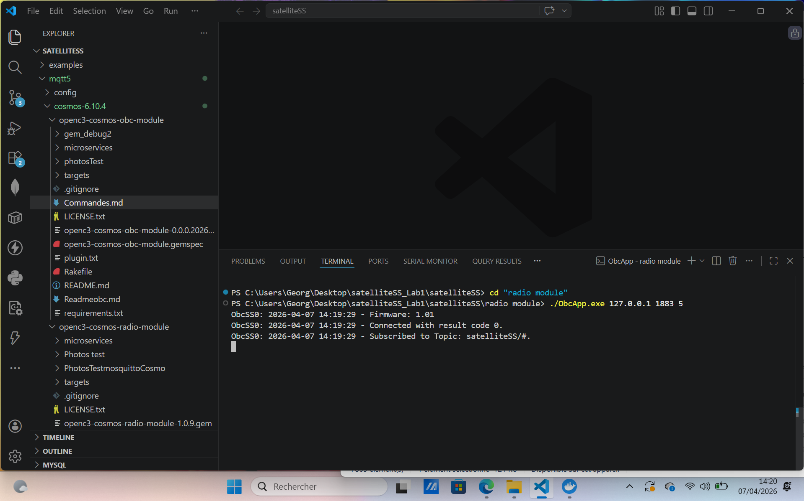
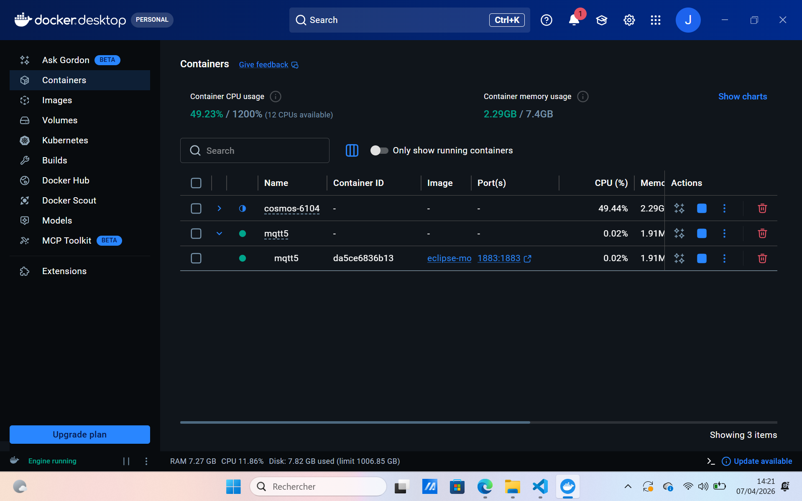
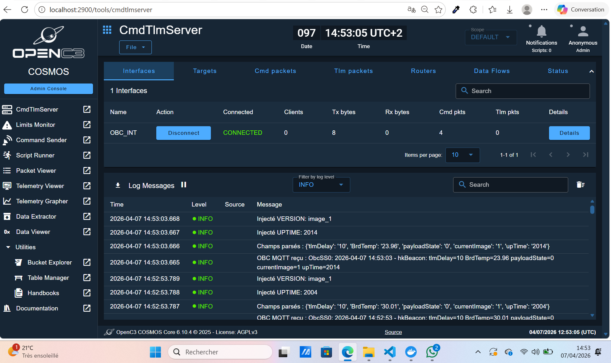
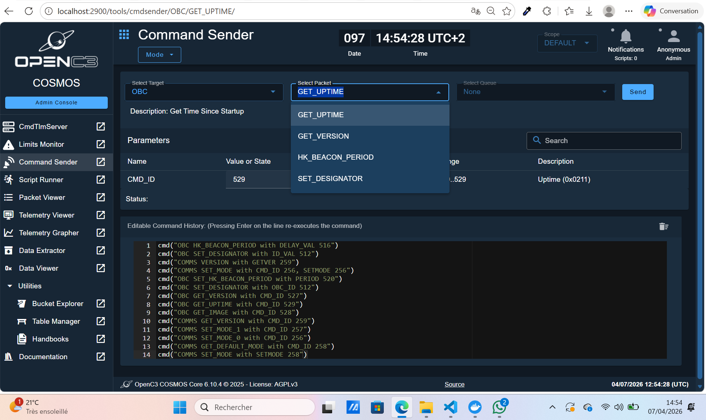
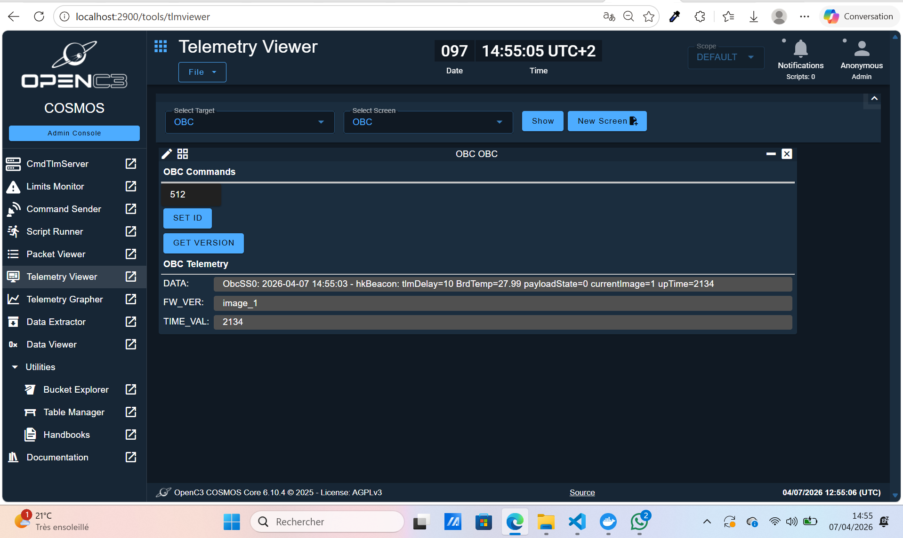

# OBC Module Report - satelliteSS Lab1

## Objective
Integration of the **OBC (On-Board Computer) module** into **OpenC3 Cosmos** via **UDP/MQTT**. Ground station interface for satellite housekeeping operations.

## What Has Been Achieved

### 1. System Architecture
```
┌─────────────┐    UDP     ┌─────────────┐    MQTT    ┌─────────┐
│   COSMOS    │ ◄────────► │  PACKET     │ ◄────────► │  OBC    │
│   (OBC)     │   8090     │  HANDLER    │ satelliteSS/obc │ APP.exe│
└─────────────┘            └─────────────┘            └─────────┘
```

- **PACKETHANDLER**: UDP 8090 → MQTT `satelliteSS/obc`
- **TLMLOADER**: MQTT → Cosmos TLM (target **OBC**)

### 2. Implemented Commands (5 validated commands)
| Command             | Hex     | Decimal  | Function                    |
|---------------------|---------|----------|-----------------------------|
| SET_DESIGNATOR      | 0x0200  | 512-515  | Assign OBC ID (0-3)        |
| SET_HK_BEACON_PERIOD| 0x0204  | 516-526  | Housekeeping interval      |
| GET_VERSION         | 0x020F  | 527      | Firmware version           |
| GET_IMAGE           | 0x0210  | 528      | Boot images                |
| GET_UPTIME          | 0x0211  | 529      | Time since startup         |

### 3. Telemetry (TLM)
| Field        | Type   | Description              |
|--------------|--------|--------------------------|
| OBC_ID       | UINT8  | Designator (0-3)        |
| UPTIME       | UINT32 | Seconds since start     |
| FW_VERSION   | UINT16 | Firmware (x100)         |
| BOOT_IMAGE   | UINT8  | Current image           |
| NEXT_IMAGE   | UINT8  | Next image              |
| HK_PERIOD    | UINT16 | Beacon interval         |
| TEMP         | UINT16 | Temperature (x100)      |
| VOLTAGE_3V   | UINT16 | 3.3V (x100)             |
| VOLTAGE_5V   | UINT16 | 5V (x100)               |
| HK_MESSAGE   | STRING | Raw HK data             |

### 4. OpenC3 Configuration
- **Target**: OBC
- **UDP Interface**: localhost:8090
- **Plugin**: `openc3-cosmos-obc-module-1.0.9.gem`

### 5. Infrastructure & Dependencies
- MQTT: port 1883
- Docker: `mqtt5/compose.yml`
- Python: paho-mqtt
- Simulator: `ObcApp.exe`

### 6. Proof of Functionality

#### Figure 1: OBC Application Simulator Running

*OBC simulator executable successfully launched and operational.*

#### Figure 2: Docker Containers Active

*All required Docker containers (MQTT broker, microservices) up and running.*

#### Figure 3: Plugin Installation Confirmed

*OpenC3 Cosmos plugin `openc3-cosmos-obc-module` successfully installed and visible in admin panel.*

#### Figure 4: Connection Established

*Successful connection between Cosmos, PACKETHANDLER microservice, and OBC simulator via UDP/MQTT.*

#### Figure 5: Commands Successfully Transmitted

*Commands like GET_VERSION (0x020F) sent and acknowledged.*

#### Figure 6: Telemetry Reception

*Real-time housekeeping telemetry (FW_VERSION, UPTIME, etc.) displayed in Cosmos interface.*

### 7. Installation & Launch
```
cd mqtt5/cosmos-6.10.4/openc3-cosmos-obc-module
rake build VERSION=1.0.9
# Install plugin OpenC3 Admin
docker compose up
ObcApp.exe
```

**Tests validated**: ✅ All 5 commands functional, real-time TLM.

## Next Steps
- More OBC commands
- ACK/NAK
- Integration with radio module
- Hardware tests

**OBC module operational and integrated! 🚀**


