# Radio Module Report - satelliteSS Lab1

## Objective
Integration of the **radio module** into **OpenC3 Cosmos** via an **MQTT bridge** (Mosquitto). Bidirectional communication:
- **UDP Commands** → MQTT `satelliteSS/radio`
- **MQTT** `satelliteSS/#` → Telemetry (TLM) OpenC3 (target **COMMS**)

## What Has Been Achieved

### 1. Developed Microservices
- **PACKETHANDLER** (UDP → MQTT):
  - Listens on UDP port **8080**
  - Extracts command ID (2 bytes big-endian)
  - Publishes to MQTT `satelliteSS/radio`
  - Example: ID 258 (SET_MODE), 259 (VERSION)

- **TLMLOADER** (MQTT → OpenC3 TLM):
  - Subscribes to `satelliteSS/#`
  - Parses and injects TLM:
    | Message Type     | Example              | TLM Packet | Item    |
    |------------------|----------------------|------------|---------|
    | Firmware Version | Firmware v1.2       | VERSION    | FW_VER  |
    | setMode          | setMode OPERATIONAL | SET_MODE   | MODE    |
    | Beacon           | Beacon data         | BEACON     | INACTBEA|

### 2. OpenC3 Configuration
- **Target**: COMMS
- **Interface**: UDP localhost:8080
- **Installed Plugin**: `openc3-cosmos-radio-module-1.0.9.gem`
- Screens: commands.txt, status.txt, telemetry.txt

### 3. Infrastructure
- **MQTT Broker**: Mosquitto (port 1883)
- **Docker Compose**: `mqtt5/compose.yml`
- Dependencies: `paho-mqtt`

### 4. Proof of Functionality

#### Basic Radio Module Tests (Photos test/)

#### Figure 1: Radio Telemetry Display
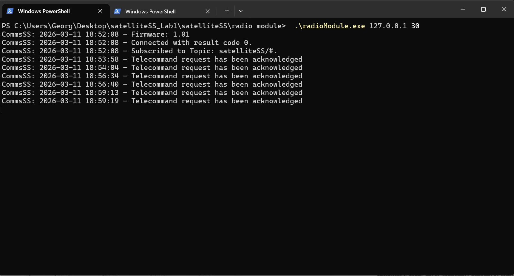
*Initial telemetry reception from radio simulator.*

#### Figure 2: Command Transmission
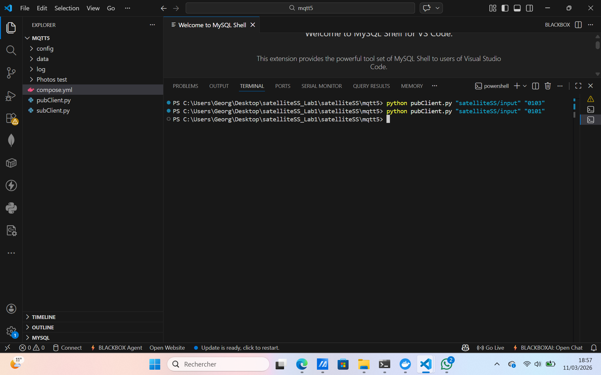
*Successful UDP command sent to PACKETHANDLER (e.g., SET_MODE).*

#### Figure 3: Radio Executable Tests
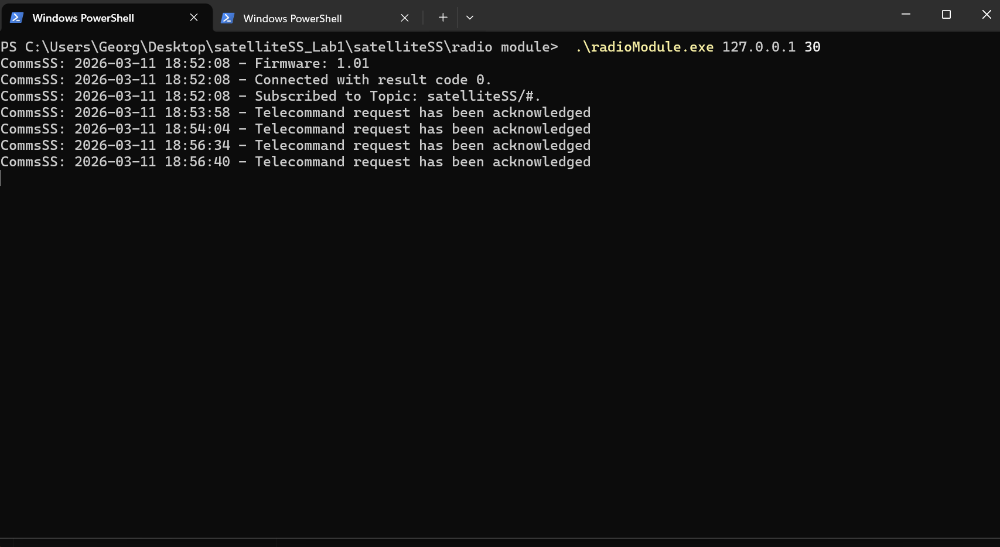
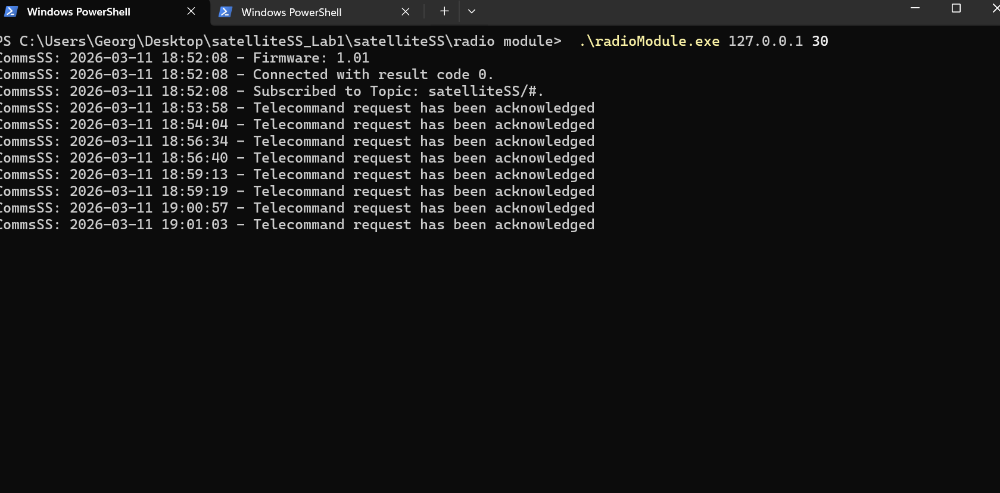
*RadioModule.exe operational, processing commands and generating TLM.*

#### Figure 4: Standalone Radio EXE
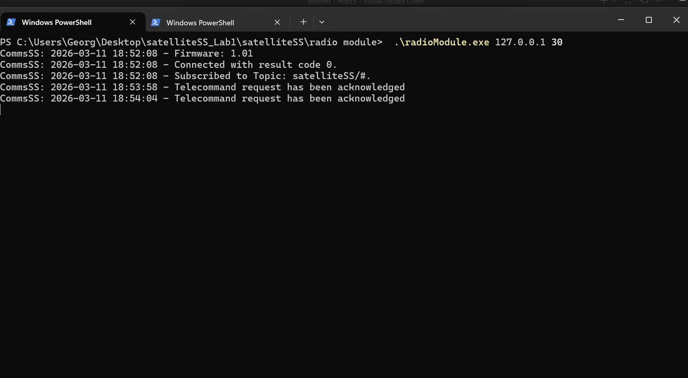
*radioModule.exe running independently.*

#### Figure 5: MQTT Subscriber Verification
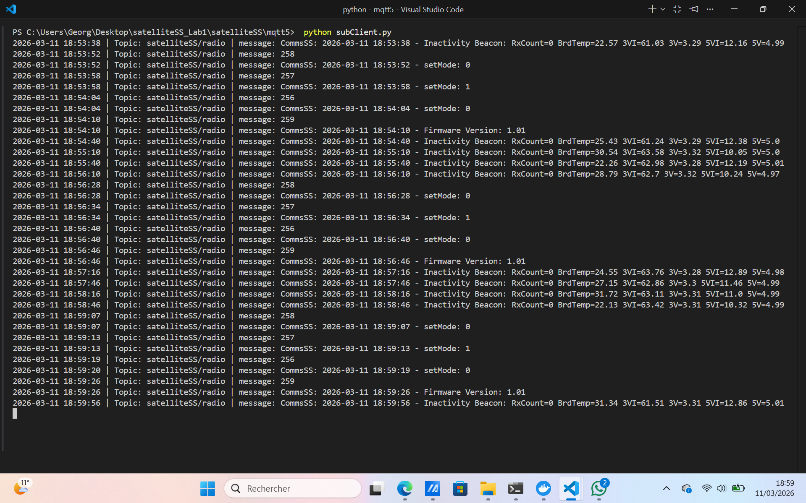
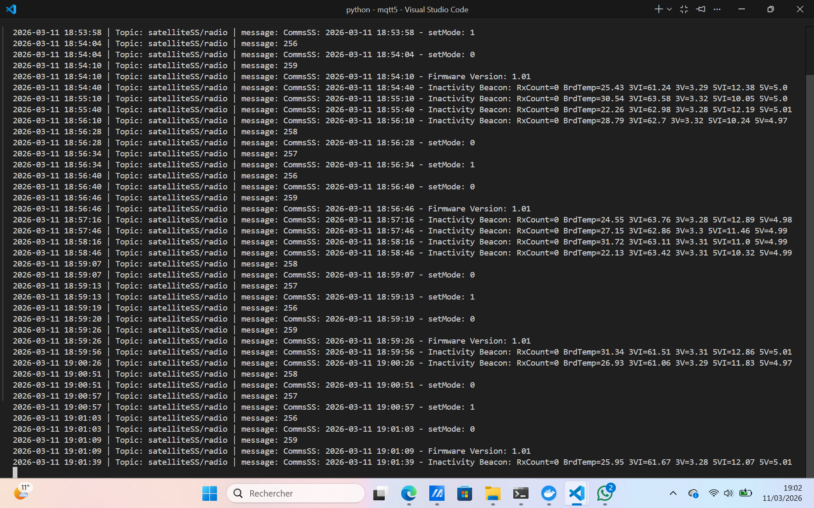
*pubClient.py/subClient.py confirming MQTT messages on satelliteSS/radio topic.*

#### Figure 6: Test Sequence
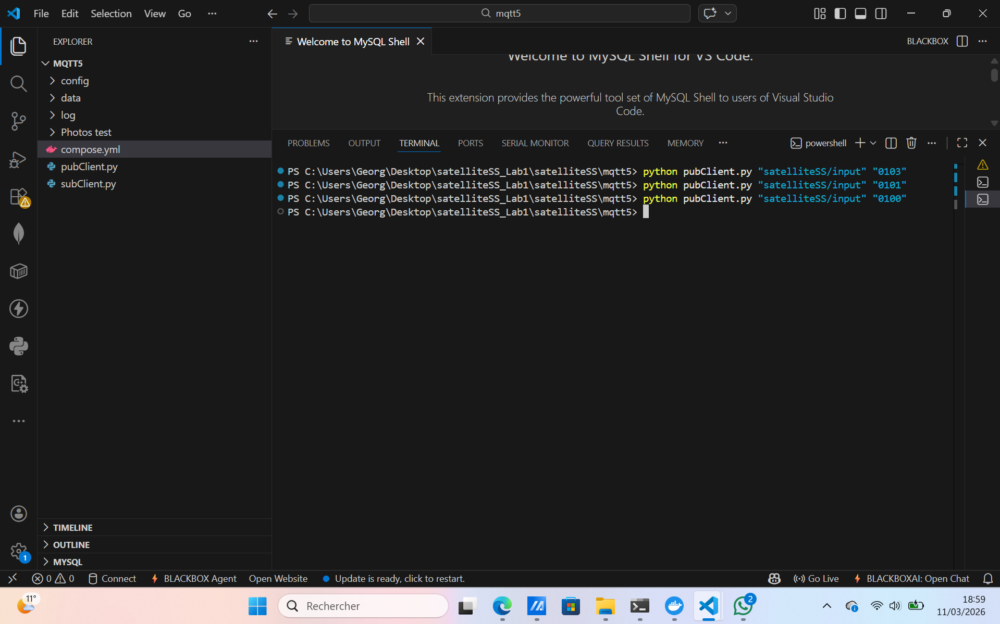
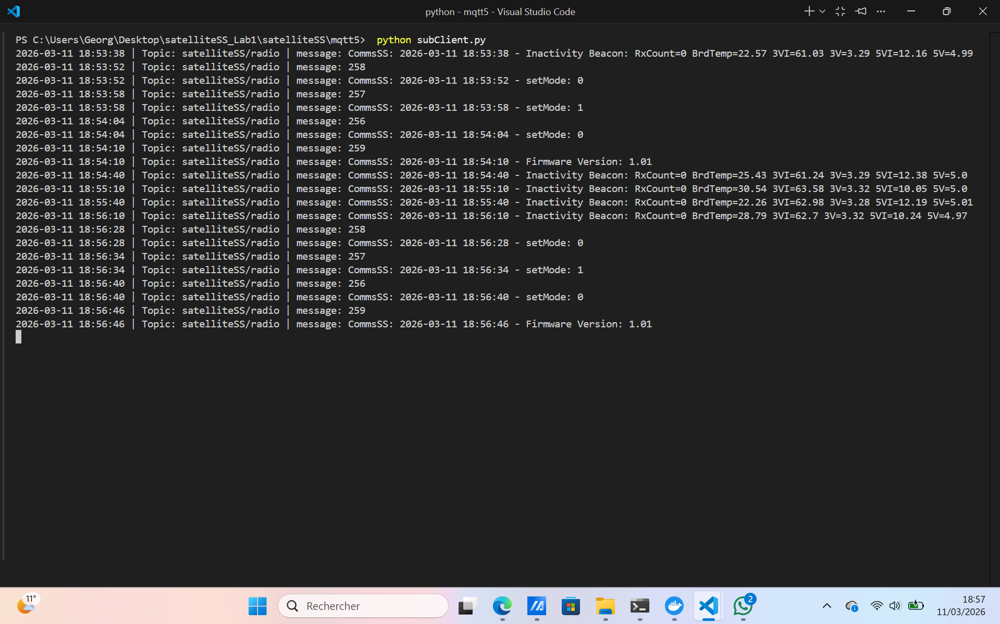
*End-to-end test: Command → MQTT → TLM.*

#### MQTT-Cosmos Integration Tests (PhotosTestmosquittoCosmo/)

#### Figure 7: Microservices Activation
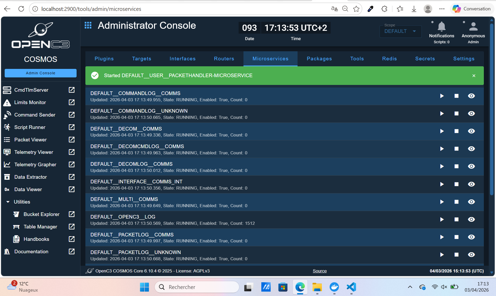
*PACKETHANDLER and TLMLOADER microservices loaded and active in OpenC3.*

#### Figure 8: Command Sending in Cosmos
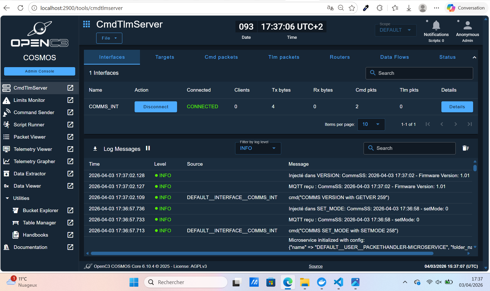
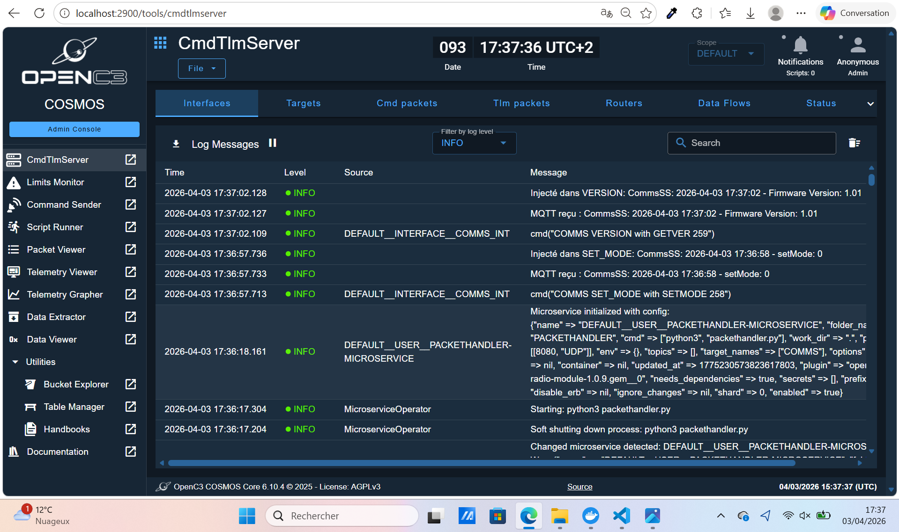
*Cosmos interface sending commands via UDP to radio module.*

#### Figure 9: MQTT Connection Confirmed
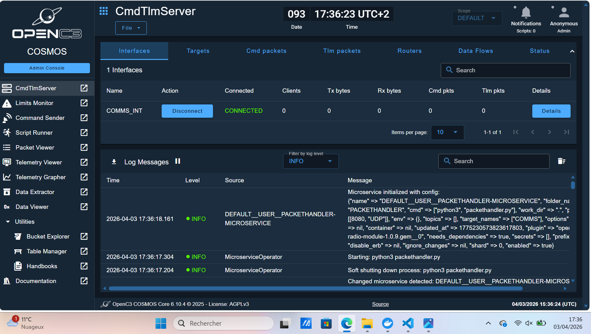
*Mosquitto broker connected, topics subscribed.*

#### Figure 10: Telemetry Graphs
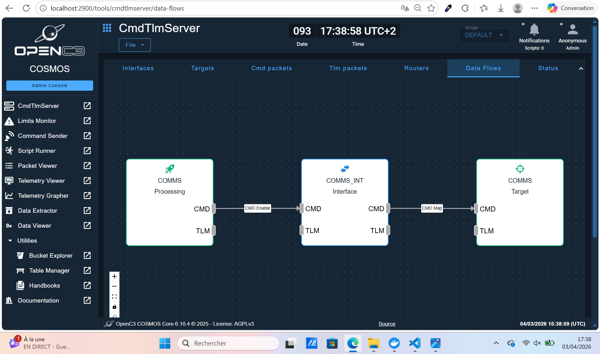
*Real-time TLM visualization (e.g., FW_VER, MODE) in Cosmos.*

#### Figure 11: Telemetry Packets
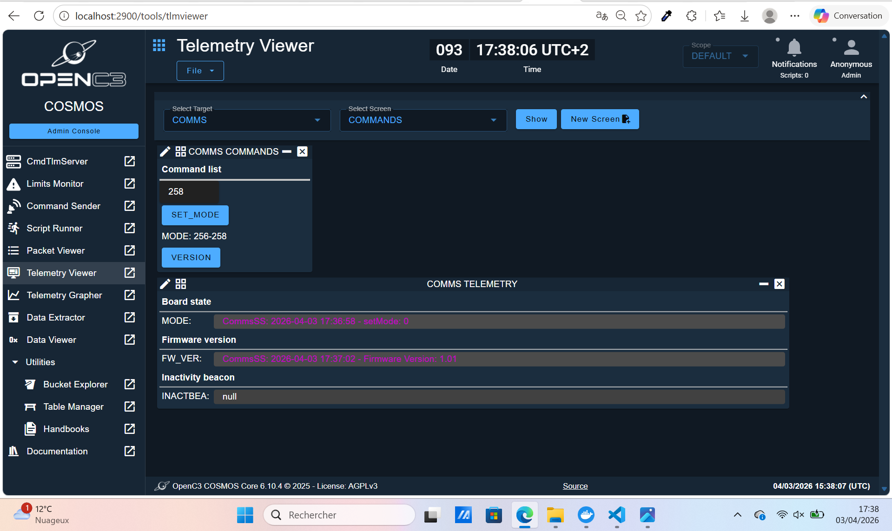
*TLMLOADER injecting radio telemetry into OpenC3 target COMMS.*

#### Figure 12: Port & Timing Setup
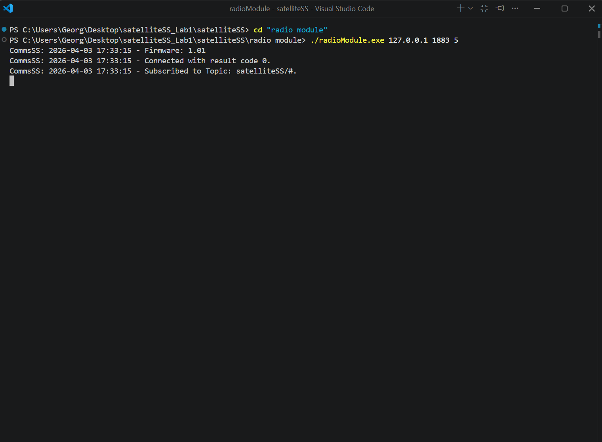
*Correct UDP 8080 and MQTT timing configuration.*

### 5. Installation & Test
```
rake build VERSION=1.0.9
# Install plugin in OpenC3 Admin
docker compose -f mqtt5/compose.yml up
```
- Check Docker logs, free ports (8080 UDP, 1883 TCP)

### 6. Standalone Executables
- `radio module/radioModule.exe`: Standalone version
- MQTT Clients: `pubClient.py`, `subClient.py`

## Suggested Next Steps
- Add more radio commands
- ACK/NAK integration
- Closed-loop tests with radio simulator
- Real hardware deployment

**Radio module functional and integrated into OpenC3 via MQTT! 🚀**

*satelliteSS Lab1 - 2024*

